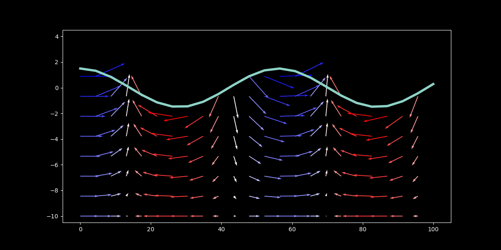
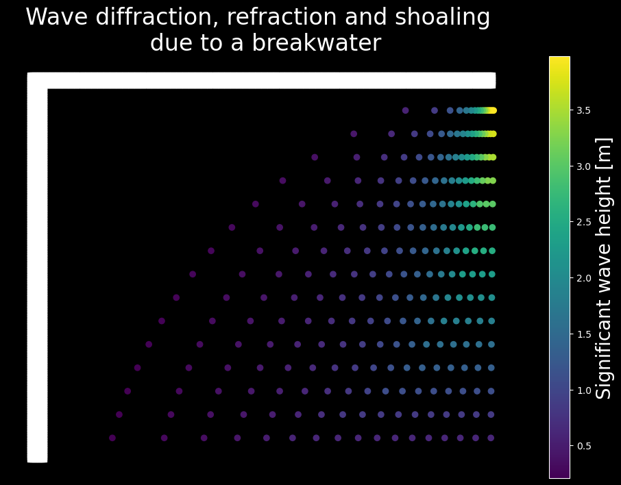

# mathematicaINpython

Translate mathematica old scripts into python readable files!!

More notebooks will be added, but for now, the horizontal and vertical velocities given a wave potential equation are calcualted in potencial.ipynb:

Moreover, we can see the wave propagation due to a breakwater:

TODO: add notebooks / src folders...
